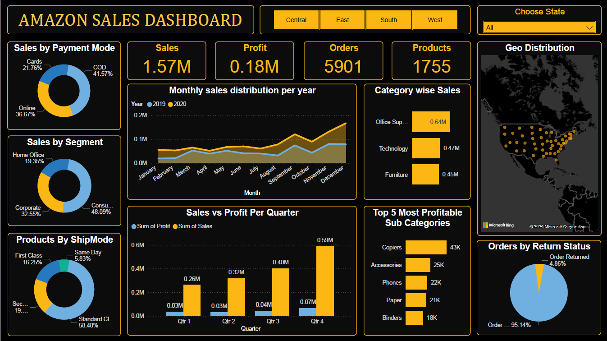

# Amazon Sales Analysis using Power BI

## Overview

This project leverages Power BI to visualize and analyze business data, providing actionable insights through interactive dashboards and reports.

**Current Analysis:**  
This report focuses on Amazon store sales, helping users understand sales trends, product performance, and customer behavior.

## Dashboard Preview



## Features

- Interactive dashboards
- Data-driven visualizations
- Customizable reports
- Region Wise Analysis


## Key Insights

- **Sales Trends:** The dashboard highlights monthly and yearly sales trends, revealing peak sales periods and seasonal patterns.
- **Top Products:** Analysis identifies the best-selling products and categories, helping to focus marketing and inventory efforts.
- **Regional Performance:** Visuals show which regions contribute most to overall sales, supporting targeted regional strategies and filters for specific regional performance tracking.
- **Categorzation :** Insights into top performing categories and purchasing behavior enable more effective promotions and engagement.
- **Profitability:** Tracks profit margins across products and time, assisting in pricing and product mix decisions.

## Project Structure

```
/project-root
│
├── Amazon Sales Analysis.pbix      # Main file
├── Amazon Store Sales Data.csv     # Source sales data
├── Amazon-Sales-Dashboard.png      # Dashboard preview image
└── ReadME.md                      # Project documentation
```


## Usage

- Explore dashboards and reports to gain insights.
- Customize visuals as needed for your business context.

---

Made with ❤️ by **Rohan Jadhav**